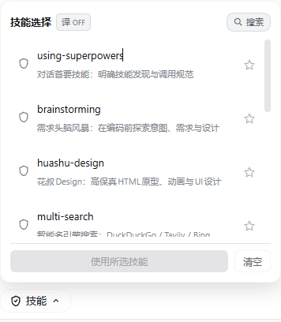
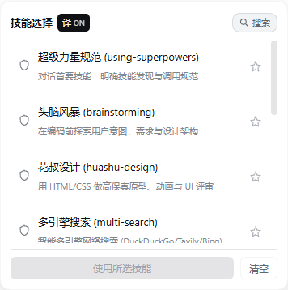
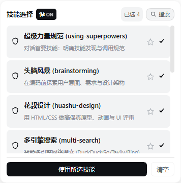
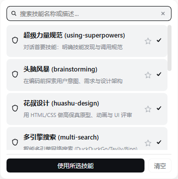

# dsh-skill-button

[English](./README.md) | **中文**

[](LICENSE)
[](https://github.com/qwd9991/dsh-skill-button/actions)


**DSH 输入框多选技能插件**——在输入框左侧注入技能按钮，多选技能后批量插入
DSH 编辑器，并可为技能名称/描述提供中文翻译。

这是面向 [DeepSeek DSH](https://github.com/deepseek-ai) 宿主的插件，需要运行中的
DSH 宿主；它**不是**独立应用。

## 功能特性

- 在 DSH 输入框左侧注入「技能」按钮（`conversation.input.left` 插槽）。
- 从宿主实时获取已安装技能列表（`remote.skills.list`），支持搜索、收藏置顶，
  并自动跳过已出现在输入框中的技能。
- 支持多选并批量插入：`/技能A /技能B …`。
- 可选技能名称/描述中文翻译，优先级如下：
  1. 宿主配置模型（`POST /skill-button/api/translate`，即设置/编辑器中选择的模型）；
  2. 离线规则词典（kebab-case 单词 → 中文）；
  3. 免费 [MyMemory API](https://mymemory.translated.net) 降级
     （仅在开启翻译且宿主模型不可用时）。

## 界面截图

| 默认视图（翻译关闭） | 翻译开启 |
| --- | --- |
|  |  |

| 多选状态 | 搜索 |
| --- | --- |
|  |  |

## 环境要求

- Node.js >= 20（见 `.nvmrc`）。
- 需要提供 `llm`、`agentDefaultModel`、`webServer` 及客户端
  `slots` / `remote.skills` / `sessions` 服务的 DSH 宿主。
- peer 依赖（`@deepseek-ai/dsh-llm`、`@deepseek-ai/dsh-tools`、
  `@deepseek-ai/dsh-client-ui-slots`、`cordis`、`schemastery`）已在
  `devDependencies` 中镜像，供开发使用；它们均已发布到公共 npm registry。

## 安装（作为 DSH 插件）

本插件可直接安装在 DSH 中：先构建，再用 DSH 宿主的插件加载方式注入/组合本目录：

```bash
npm ci
npm run build
# 然后用 DSH 宿主的插件加载方式注入/组合本目录
```

如需与本地 DSH monorepo 匹配：

```bash
DSH_CHECKOUT=<path-to-dsh-checkout> bash scripts/build.sh
```

## 开发

```bash
npm ci
npm run typecheck    # 针对公共 npm 包做严格类型检查
npm run build        # tsc（src → lib/）+ tsdown 客户端打包
npm run check:public # 防止宿主专用路径/凭据混入 src 或 scripts
```

## 隐私

开启翻译开关后，未缓存技能的名称与描述会发送给宿主配置的模型；当宿主模型
不可用时，描述可能被发送给第三方免费翻译服务 `api.mymemory.translated.net`
（其会保留一段时间的日志）。翻译默认**关闭**，不开启就不会有任何第三方调用。
客户端状态（收藏、翻译缓存）仅保存在 `localStorage`。

## 许可

[BSD-3-Clause](LICENSE)。

## 致谢

- 基于 `@deepseek-ai` 相关包构建的 DSH 插件。
- 免费翻译降级服务由 MyMemory 提供。
